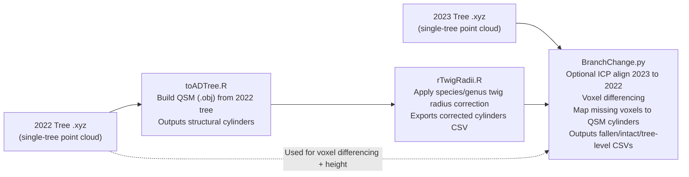

# BranchesChange: Inputs, Parameters, and Outputs (Developer Notes)

This document describes the **BranchesChange** Python workflow for branch-level change detection between two single-tree point clouds (2022 as reference, 2023 as comparison), using voxel differencing, cylinder (QSM) mapping, and optional ICP alignment.

---

## 1) What the pipeline does

Per tree, the pipeline:

1. Loads **2022** and **2023** `.xyz` point clouds (first 3 columns, robust parsing).
2. Optionally aligns **2023 → 2022** using **ICP** (rigid transform).
3. Voxelizes both trees and identifies voxels present in 2022 but missing in 2023 (candidate lost material).
4. Clusters missing voxels using DBSCAN (connectivity in voxel space).
5. Maps clustered missing voxels to **QSM cylinders** by checking if cylinder start/end points fall into missing voxels.
6. Uses a KDTree proximity test against the 2023 point cloud to confirm cylinders are “missing”.
7. Optionally **expands missing sets** to represent a larger limb:
   - **connect_to_parent**: grow upward along the parent-child cylinder graph to anchor at a larger limb
   - **capture_descendants**: grow downward to include child cylinders (sub-branches) that are part of the same break
8. Produces:
   - a **fallen branches** CSV (branch-level metrics for lost limbs)
   - an **intact branches** CSV (branch-level metrics for limbs not flagged as lost)
   - a **tree-level** CSV (tree summary: DBH, height, lost ratio, ICP stats)
   - an optional XYZ export for each lost unit (for debugging/visualization)

---

## 2) Required inputs (files/folders)

### 2.1 Point clouds
- **2022 source folder** (`in_dir_src`)
  - contains `.xyz` files for each tree
  - naming must include a tree index token that matches 2023, using:
    - `tree_index_str = filename.split(" ")[2]`

- **2023 target folder** (`in_dir_target`)
  - contains matching `.xyz` files for the same trees and indexing convention

**Point cloud format:**
- whitespace-separated values
- first 3 columns are interpreted as `X Y Z`
- additional columns are ignored

### 2.2 QSM cylinders (rTwig corrected)
- `qsm_dir` contains per-tree subfolders like:
  - `arbre 2022 ## ... SPECIES/`
- must contain:
  - `*_branches_cylinders_corrected.csv`

**Required columns in corrected cylinder CSV (normalized internally):**
- startX, startY, startZ
- endX, endY, endZ
- cyl_ID
- parent_ID
- radius_cyl
- length
- branch
- branch_order
- volume (or volume_m3; if missing it is computed)

---

## 3) Runner parameters (what each one does)

These parameters are typically passed to the class constructor and sometimes overridden in `run()`.

### 3.1 Core detection parameters

#### `radius` (float, meters)
Used in the **KDTree proximity test** against the 2023 point cloud:
- For each candidate cylinder, the algorithm tests whether the cylinder **start and/or end** point has ≥ `min_neighbors` points within `radius` in 2023.
- If **neither** endpoint has enough neighbors, the cylinder is treated as “missing”.

**Increase radius:**
- More cylinders will be considered “present” (because more 2023 points fall within the search ball).
- You typically get **fewer false positives**, but can miss small losses (more false negatives).

**Decrease radius:**
- Harder to be considered present.
- You typically get **more sensitivity**, but also **more false positives** due to minor misalignment, occlusion, or noise.

---

#### `min_neighbors` (int)
Minimum number of 2023 points required within `radius` of a cylinder endpoint to treat it as present.

**Increase min_neighbors:**
- Stricter presence test.
- More cylinders will be flagged missing (more sensitive but more false positives in sparse/occluded areas).

**Decrease min_neighbors:**
- Easier presence test.
- Fewer cylinders flagged missing.

Most of your runs use `min_neighbors=1` (presence if any return exists nearby).

---

#### `voxel_size` (float, meters)
Voxel resolution used in voxelization for change detection:
- smaller voxels = finer change detection, more fragmentation, higher compute
- larger voxels = smoother change signal, fewer small features detected

**Increase voxel_size:**
- more smoothing
- fewer small breaks detected
- less fragmentation in canopy edges
- lower runtime and memory

**Decrease voxel_size:**
- more detail
- more fragmentation and noise sensitivity
- higher runtime and memory

---

#### `voxel_dilation` (int, voxels)
Dilation applied when computing “missing voxels” (tree1-only voxels).
This acts like a tolerance buffer in voxel space.

**Increase voxel_dilation:**
- reduces sensitivity to small positional mismatch and sparse returns
- can merge nearby missing regions
- may reduce false positives (but can also swallow small intact areas)

**Decrease voxel_dilation:**
- stricter differencing, higher sensitivity
- more fragmentation and false positives if alignment is imperfect

---

#### `min_samples` (int)
DBSCAN parameter applied to the missing voxel set.
Controls how many nearby missing voxels are required to form a cluster.

**Increase min_samples:**
- filters out small “speckle noise” voxel groups
- may remove true small breaks

**Decrease min_samples:**
- keeps small clusters
- more noise clusters are treated as candidate breaks

---

#### `min_branch_length_m` (float, meters)
Minimum summed cylinder length for a detected unit to be recorded as a branch event.

After missing cylinders are grouped into a unit (and optionally expanded upward and/or downward along the cylinder graph), the total length of all cylinders in that unit is summed. If the total length is less than or equal to `min_branch_length_m`, that unit is discarded and not written to the outputs.

Increase `min_branch_length_m`:
- Filters out small distal twigs and minor fragmentation artifacts.
- Reduces false positives caused by voxel speckle, occlusion, or sparse returns.
- Biases results toward larger structural failures.

Decrease `min_branch_length_m`:
- Includes smaller branch failures.
- Increases sensitivity to fine-scale canopy damage.
- Can increase false positives, especially at canopy edges.

This parameter does not change the voxel differencing or KDTree missing test itself. It changes which detected units are retained in the final branch outputs.

---

## Output files and schemas

The workflow writes four CSV files to `out_dir`:

- `fallen_branches.csv`
- `intact_branches.csv`
- `tree_level.csv`
- `failures.csv`

---

### `fallen_branches.csv`

Each row represents one detected lost branch unit after all splitting, expansion, and merging logic has been applied.

#### Structural identifiers

- `tree_index`  
  Tree identifier parsed from the filename (used to match 2022 and 2023).

- `tree_folder`  
  Folder name containing the rTwig corrected cylinder CSV used for this tree.

- `parent_branch_id`  
  The rTwig branch ID associated with the most proximal cylinder in the detected unit. This is the structural limb that the break is anchored to.

- `n_child_branches`  
  Number of distinct rTwig branch IDs absorbed into this unit, excluding the parent branch ID. This indicates how many sub-branches were merged into the break event.

- `child_branch_ids`  
  Comma-separated list of rTwig branch IDs included as descendants within this unit (excluding the parent).

#### Geometric and structural metrics

- `volume`  
  Total cylinder volume (m³) summed across all cylinders in the unit.

- `length`  
  Total cylinder length (m) summed across all cylinders in the unit.

- `surface`  
  Total lateral cylinder surface area (m²) summed across the unit. If surface area is not present in the cylinder table, it is derived as `2πrL` per cylinder and summed.

- `max_radius`  
  Maximum cylinder radius (m) within the unit. Often correlates with limb size and branch order.

#### Orientation metrics

- `angle`  
  Length-weighted mean angle from vertical (degrees) across the unit. Higher values indicate more horizontal structure.

- `origin2com`  
  Percent position of the volume-weighted center of mass along the unit’s principal proximal-to-distal axis. Values near 0 indicate mass concentrated near the origin; values near 100 indicate mass concentrated toward the distal end.

#### Direction vector and derived angles

- `dir_dx`, `dir_dy`, `dir_dz`  
  Proximal-to-distal direction vector (difference between distal and proximal unit centers) in the same coordinate system as the point clouds and QSM.

- `azimuth_deg`  
  Horizontal direction of the unit in degrees (0–360), computed from `dir_dx` and `dir_dy`. Interpretable as compass-like orientation in the XY plane.

- `inclination_deg`  
  Vertical inclination relative to the horizontal plane (degrees), computed from `dir_dz` and horizontal magnitude of (`dir_dx`, `dir_dy`). Positive values incline upward; negative values incline downward.

#### Tree context

- `dbh_m`  
  Diameter at breast height (m), computed from QSM cylinders intersecting the 1.3 m height plane above the estimated base elevation.

- `height_m`  
  Tree height (m) derived from the 2022 point cloud as `max(z) - min(z)`.

- `lost_volume_ratio`  
  Ratio of total fallen volume to total tree cylinder volume. This is the tree-level loss fraction assigned to each branch row for convenience.

#### Bookkeeping and file outputs

- `unit_key`  
  Stable unique identifier for the detected unit (used to avoid collisions/overwrites when saving per-unit XYZ subsets).

- `saved_xyz`  
  File path of the exported XYZ subset for this branch unit, if saving is enabled. Empty otherwise.

---

## Branch Position Metrics

All metrics below are computed **per recorded unit** (fallen or intact), using the full merged cylinder set for that unit.

---

### `branch_base_z_m` (meters)

**Definition**  
Z elevation (in the same coordinate system as the XYZ/QSM) of the proximal point of the branch unit.

**Typical range**  
`[z0, z0 + height_m]`

**Interpretation**  
Indicates where along the vertical extent of the tree the branch unit originates.

---

### `branch_base_height_ratio` (unitless)

**Definition**  
Normalized base height:

(branch_base_z_m - z0) / height_m

**Typical range**  
`[0, 1]`

- `0` → near ground or lowest modeled point  
- `1` → near the top of the tree  

**Interpretation**  
Represents the attachment height of the unit relative to total tree height.

---

### `branch_com_z_m` (meters)

**Definition**  
Z elevation of the **volume-weighted center of mass (COM)** of the branch unit, computed from cylinder centers.

**Typical range**  
`[z0, z0 + height_m]`

**Interpretation**  
Indicates where most of the branch volume is located vertically.

---

### `branch_com_height_ratio` (unitless)

**Definition**  
Normalized COM height:

**Typical range**  
`[0, 1]`

**Interpretation**  
Higher values indicate that the bulk of the unit’s mass is located higher in the crown.

---

### `branch_base_xy_dist_to_tree_centroid_m` (meters)

**Definition**  
Horizontal (XY) distance between the branch base and the tree XY centroid.

The tree XY centroid is computed as the mean XY of all cylinder centers.

**Typical range**  
`>= 0`

**Interpretation**  
- Small values → branch originates near the stem or inner crown  
- Large values → branch originates further laterally from the tree center  

---

### `branch_com_xy_dist_to_tree_centroid_m` (meters)

**Definition**  
Horizontal (XY) distance between the branch COM and the tree XY centroid.

**Typical range**  
`>= 0`

**Interpretation**  
High values indicate canopy-edge mass distribution; low values indicate inner-crown mass.

---

### `branch_base_stem_dist_m` (meters)

**Definition**  
Shortest horizontal (XY) distance from the branch base to the estimated stem axis.

The stem axis is estimated using PCA on trunk cylinder centers.

**Typical range**  
`>= 0`

**Interpretation**  
- `0` → base lies directly on the stem axis (rare except for stem-like structures)  
- Larger values → branch originates farther from the stem line  

---

### `branch_com_stem_dist_m` (meters)

**Definition**  
Shortest horizontal (XY) distance from the branch COM to the estimated stem axis.

**Typical range**  
`>= 0`

**Interpretation**  
Directly quantifies how far the bulk of the branch unit extends from the stem.

---

### `outer_canopy_ratio` (unitless)

**Definition**  
Normalized outer canopy score:

Where:

- `crown_r95` is the 95th percentile of XY distances of 2022 points from the tree centroid.

**Typical range**

- Approximately `0` to `1`  
- May exceed `1` if the COM lies beyond the 95th percentile crown radius (outliers or irregular geometry)

**Interpretation**

- ~0.2 → inner crown  
- ~0.6 → mid crown  
- ~0.9+ → near canopy edge or exposed  

If `crown_r95` cannot be computed (sparse points or degenerate geometry), this metric is set to `NaN`.

---

### `intact_branches.csv`

Rows represent branches (typically rTwig `branch` IDs) that are not classified as fallen.

Selection logic (conceptual):
- Start from all branch IDs in the QSM, excluding the trunk branch.
- Remove branch IDs that appear as `parent_branch_id` in fallen units.
- Apply the same minimum length threshold (`min_branch_length_m`) so extremely small intact branches can be excluded.

The schema matches `fallen_branches.csv` so intact and fallen units can be analyzed together. For intact rows:
- `parent_branch_id` corresponds to the intact branch ID.
- `n_child_branches` is typically 0 (unless you intentionally aggregate intact limbs similarly).
- `saved_xyz` is usually empty unless you explicitly add intact XYZ export.

---

### `tree_level.csv`

One row per processed tree.

- `tree_index`  
  Tree identifier parsed from filename.

- `tree_folder`  
  rTwig/QSM folder used for this tree.

- `lost_volume_ratio`  
  Total fallen cylinder volume divided by total cylinder volume for this tree.

- `dbh_m`  
  Tree DBH (m) derived from QSM cylinders at 1.3 m.

- `dbh_n_cyl`  
  Number of QSM cylinders intersecting the DBH height plane.

- `height_m`  
  Tree height (m) computed from the 2022 point cloud vertical extent.

- `n_cylinders`  
  Number of cylinders in the QSM cylinder table.

- `n_fallen_units`  
  Number of fallen branch units written to `fallen_branches.csv` for this tree (after filtering/merging).

- `n_fallen_parent_branches`  
  Number of unique `parent_branch_id` values among fallen units. This is often closer to “how many limbs broke” than `n_fallen_units` when fragmentation exists.

- `icp_fitness`  
  ICP quality metric: fraction of inlier correspondences (higher is better). Present if ICP is enabled.

- `icp_inlier_rmse`  
  ICP inlier RMSE (lower is better). Present if ICP is enabled.

---

### `failures.csv`

One row per tree that could not be processed due to missing inputs or runtime errors.

- `tree_index`  
  Tree identifier (if parsed successfully).

- `tree_folder`  
  Empty or best-effort value when failure occurs early.

- `err`  
  Error message describing why the tree failed processing.

---

## Notes on fragmentation vs aggregation

If you want to save only the largest branches possible:
- Set `split_units_by_branch_id = FALSE` so units are not split by rTwig branch ID.
- Set `connect_to_parent = TRUE` to grow upward to the larger limb.
- Set `capture_descendants = TRUE` to absorb child sub-branches into the same break.
- Set `merge_by_parent_branch = TRUE` to merge fragmented units that anchor to the same parent limb.
- Consider increasing `voxel_dilation` and/or `voxel_size` slightly if canopy-edge holes are creating fragmented missing-voxel clusters.

